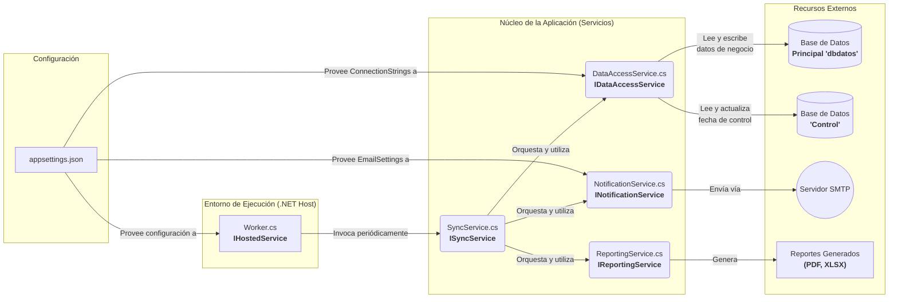

[**< Volver al README Principal**](../README.md)

---

### Documentación del Proyecto
1.  **Arquitectura del Sistema (Usted está aquí)**
2.  [Flujo de Ejecución](./2_flujo_de_ejecucion.md)
3.  [Configuración y Variables de Entorno](./3_configuracion.md)
4.  [Dependencias del Proyecto](./4_dependencias.md)

---

# 1. Arquitectura del Sistema

La arquitectura del `ServicioSincArrendamiento` está diseñada para ser **modular, robusta y mantenible**, siguiendo principios de diseño de software modernos. El objetivo es desacoplar las responsabilidades para que cada componente sea independiente y fácil de probar o reemplazar.

## Principios de Diseño Clave

-   **Inyección de Dependencias (DI)**: El servicio utiliza intensivamente la inyección de dependencias. Ningún servicio crea sus propias dependencias (ej. `SyncService` no crea una instancia de `DataAccessService`). En su lugar, las "pide" en su constructor. El Host de .NET se encarga de construir y "cablear" todos los objetos en el inicio de la aplicación (`Program.cs`), promoviendo un bajo acoplamiento.
-   **Principio de Responsabilidad Única (SRP)**: Cada clase tiene una única y bien definida responsabilidad.
    -   El `Worker` solo se encarga del *cuándo* (temporizador).
    -   El `SyncService` se encarga del *qué* y *en qué orden* (orquestación).
    -   Los otros servicios se encargan del *cómo* (acceso a datos, generación de reportes, envío de emails).

## Diagrama de Arquitectura Mejorado

El siguiente diagrama visualiza la estructura de la aplicación, las dependencias entre componentes y las interacciones con sistemas externos.

## Descripción Detallada de Componentes

### Entorno de Ejecución
-   **Worker.cs (`IHostedService`)**: Es el punto de entrada que el Host de .NET gestiona. Su única responsabilidad es actuar como un programador de tareas usando `Task.Delay` con cálculo de tiempo. No contiene lógica de negocio; su función es "despertar" al `SyncService` en los intervalos definidos en la configuración.

### Núcleo de la Aplicación
-   **SyncService.cs (`ISyncService`)**: Es el **orquestador central**. Define el flujo de trabajo completo: cuándo ejecutar, qué procesos llamar, si se deben generar reportes y a quién notificar. No realiza ninguna de estas acciones directamente, sino que delega en los servicios especializados.
-   **DataAccessService.cs (`IDataAccessService`)**: Actúa como una capa de abstracción de datos (DAL). Es el **único componente que sabe cómo comunicarse con las bases de datos**. Centraliza todo el código SQL (consultas, llamadas a Stored Procedures) y maneja las dos conexiones: una a la base de datos de negocio y otra a la de control.
-   **ReportingService.cs (`IReportingService`)**: Es un servicio de utilidad enfocado exclusivamente en la **creación de archivos**. Su trabajo es recibir una lista de datos y transformarla en un formato específico (PDF o Excel). Es completamente agnóstico a la naturaleza de los datos.
-   **NotificationService.cs (`INotificationService`)**: Otro servicio de utilidad que se especializa únicamente en **enviar notificaciones**. Abstrae la complejidad de interactuar con un servidor SMTP, construir un email y adjuntar archivos.

### Configuración y Recursos
-   **appsettings.json**: Es el **panel de control** de la aplicación. Externaliza todas las variables que pueden cambiar entre entornos (desarrollo, producción), como cadenas de conexión, configuración de correo y parámetros de ejecución.
-   **Recursos Externos**: Son los sistemas con los que interactúa el servicio pero que viven fuera de él: las **bases de datos SQL Server**, el **servidor de correo SMTP** y el **sistema de archivos** donde se guardan los reportes generados.
