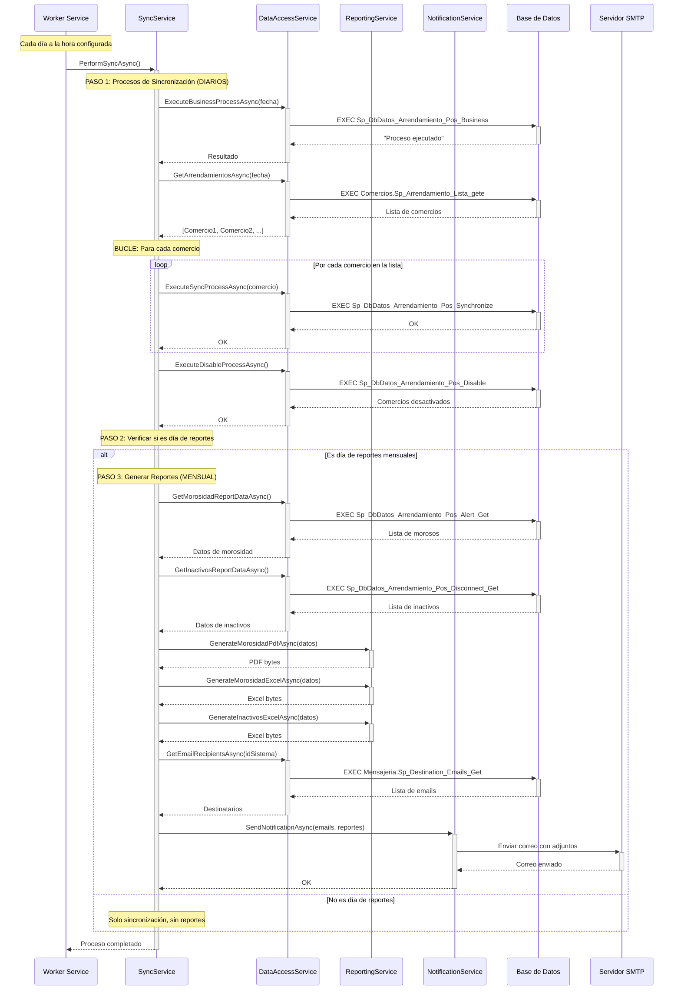

[**< Volver al README Principal**](../README.md)

---

### Documentación del Proyecto
1.  [Arquitectura del Sistema](./1_arquitectura.md)
2.  **Flujo de Ejecución (Usted está aquí)**
3.  [Configuración y Variables de Entorno](./3_configuracion.md)
4.  [Dependencias del Proyecto](./4_dependencias.md)

---

# 2. Flujo de Ejecución

Este documento explica paso a paso cómo funciona el servicio, desde que se inicia hasta que termina un ciclo completo.

## 📊 Diagrama de Secuencia Real



## 🔄 **Explicación Paso a Paso**

### 🕐 **PASO 1: Inicio Programado**
**¿Cuándo?** Todos los días a la hora configurada en `ExecutionTime` (ej: 23:00)

1. El `Worker` usa `Task.Delay` para esperar hasta la hora programada
2. Cuando llega la hora, llama a `SyncService.PerformSyncAsync()`

### 🔄 **PASO 2: Sincronización Diaria (SIEMPRE se ejecuta)**

#### 2.1 Ejecutar Lógica de Negocio
```csharp
await _dataAccess.ExecuteBusinessProcessAsync(DateTime.UtcNow);
```
- **SP:** `Sp_DbDatos_Arrendamiento_Pos_Business`
- **Propósito:** Prepara los datos para el proceso de débitos

#### 2.2 Obtener Lista de Comercios
```csharp
var arrendamientos = await _dataAccess.GetArrendamientosAsync(DateTime.UtcNow);
```
- **SP:** `Comercios.Sp_Arrendamiento_Lista_gete`
- **Propósito:** Obtiene todos los comercios que tienen terminales con arrendamiento activo
- **Resultado:** Lista de comercios con: Retailer, Padre, Consolidar, Monto, Cantidad

#### 2.3 Sincronizar Cada Comercio (BUCLE)
```csharp
foreach (var arrendamiento in arrendamientos)
{
    await _dataAccess.ExecuteSyncProcessAsync(arrendamiento);
}
```
- **SP:** `Sp_DbDatos_Arrendamiento_Pos_Synchronize` (se ejecuta una vez por comercio)
- **Propósito:** Actualiza o inserta datos en `DBDATOS_ARRENDAMIENTO_COMERCIOS_TEMP`

#### 2.4 Desactivar Comercios Obsoletos
```csharp
await _dataAccess.ExecuteDisableProcessAsync();
```
- **SP:** `Sp_DbDatos_Arrendamiento_Pos_Disable`
- **Propósito:** Marca como inactivos los comercios que ya no aparecen en la lista

### 📊 **PASO 3: Verificación de Reportes Mensuales**

El servicio calcula el día objetivo de reporte como el último día del mes menos `AdvanceDays` y compara con la fecha actual (UTC):

```csharp
var today = DateTime.UtcNow;
var lastDayOfMonth = new DateTime(today.Year, today.Month, DateTime.DaysInMonth(today.Year, today.Month));
var targetReportDate = lastDayOfMonth.AddDays(-_syncSettings.AdvanceDays);
bool isReportDay = today.Date == targetReportDate.Date;
```

Si `SkipReportDateValidation` es `true`, se fuerzan los reportes sin validar el día.

### 📧 **PASO 4: Generación y Envío de Reportes (SOLO si es día de reportes)**

#### 4.1 Obtener Datos
```csharp
var morosidadData = await _dataAccess.GetMorosidadReportDataAsync();
var inactivosData = await _dataAccess.GetInactivosReportDataAsync();
```

#### 4.2 Generar Archivos
```csharp
var pdfMorosidad = await _reportingService.GenerateMorosidadPdfAsync(morosidadData, logo);
var excelMorosidad = await _reportingService.GenerateMorosidadExcelAsync(morosidadData);
var excelInactivos = await _reportingService.GenerateInactivosExcelAsync(inactivosData);
```

#### 4.3 Enviar por Email
```csharp
var recipients = await _dataAccess.GetEmailRecipientsAsync(_appSettings.IdSistema);
await _notification.SendNotificationAsync(recipients, attachments, sendNoMorosidadNotification);
```

## 🎯 **Modos de Operación**

### 🔄 **Modo "Flexible" (Recomendado)**
- **Con datos de morosidad:** Envía PDF + Excel de morosidad + Excel de inactivos
- **Sin datos de morosidad:** Envía solo Excel de inactivos + mensaje "Sin morosidad"

### 🔄 **Modo "Force"** 
- **Siempre:** Envía todos los reportes, aunque estén vacíos

### 🔄 **Modo "None"**
- **Solo sincronización:** No genera ni envía reportes

## ⚠️ **Manejo de Errores**

Si ocurre cualquier error durante el proceso:

1. **Se captura la excepción**
2. **Se registra en los logs**
3. **Se intenta enviar un email de error:**
   ```
   Asunto: [ERROR CRITICO] Reportes Mensuales...
   Mensaje: El servicio ha fallado. Mensaje: [detalle del error]
   ```

## 🔧 **Configuraciones que Afectan el Flujo**

| Configuración | Efecto en el Flujo |
|---------------|-------------------|
| `ExecutionTime: "23:00"` | Hora de inicio diario |
| `AdvanceDays: 20` | Cuándo considera "fin de mes" |
| `SkipReportDateValidation: true` | Fuerza reportes siempre |

> Nota de zona horaria: `Worker` usa hora local (`DateTime.Now`) para programar, mientras que `SyncService` usa UTC para cálculos de reportes. Ajusta si necesitas alineación estricta.
| `ReportMode: "None"` | Salta completamente el paso 4 |

## 🚀 **Resumen del Flujo Real**

1. **🕐 Esperar** hasta la hora programada
2. **🔄 Sincronizar** datos (SIEMPRE - todos los días)
   - Ejecutar lógica de negocio
   - Obtener lista de comercios activos
   - Actualizar datos de cada comercio (bucle)
   - Desactivar comercios obsoletos
3. **📅 Verificar** si es día de reportes
4. **📊 Generar y enviar** reportes (SOLO si es necesario)
5. **✅ Terminar** hasta el día siguiente

---
<br>

| [**< Anterior**](./1_arquitectura.md) <br> *1. Arquitectura del Sistema* | [**Volver al Inicio**](../README.md) | **Siguiente >** <br> [*3. Configuración*](./3_configuracion.md) |
|:---|:---:|---:|
