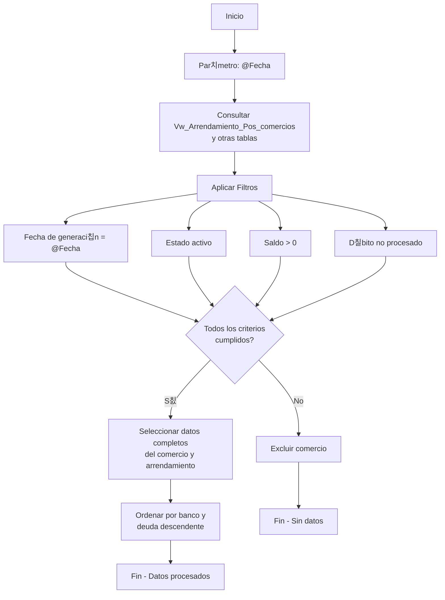
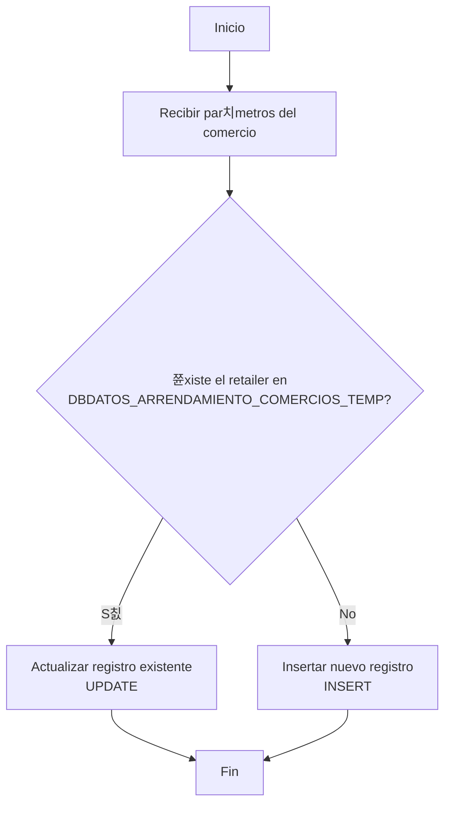
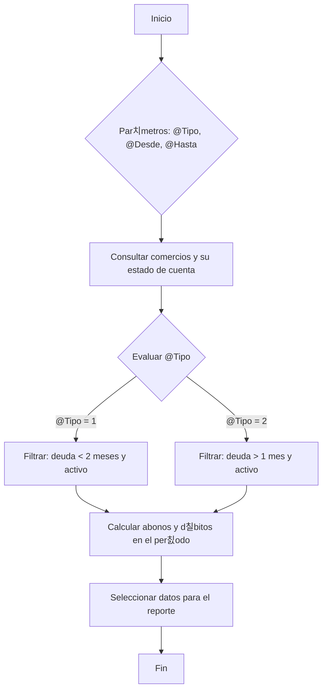
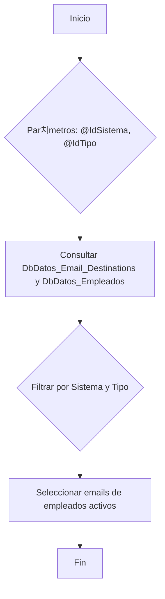
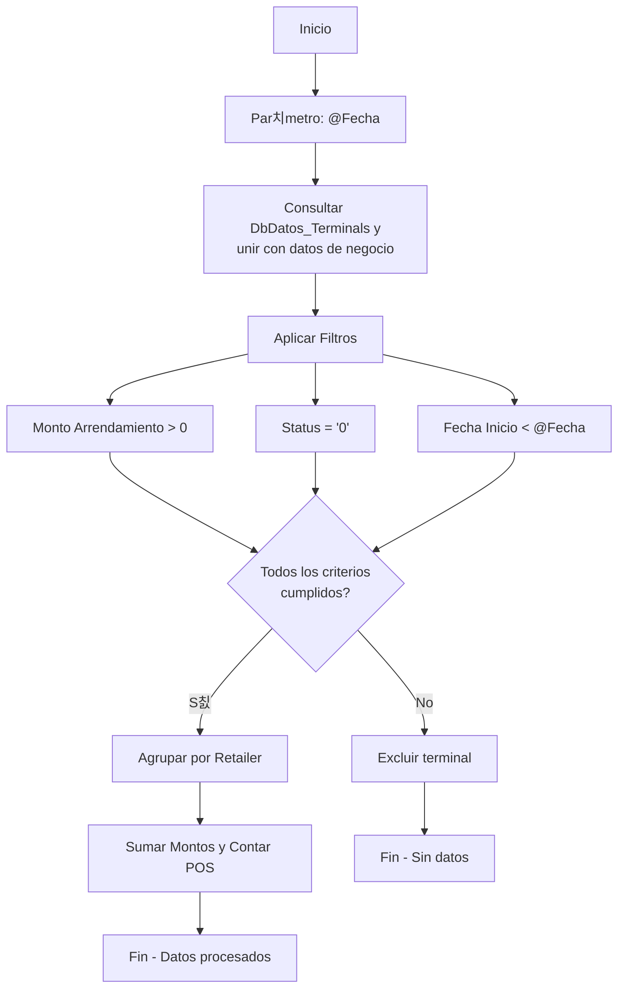
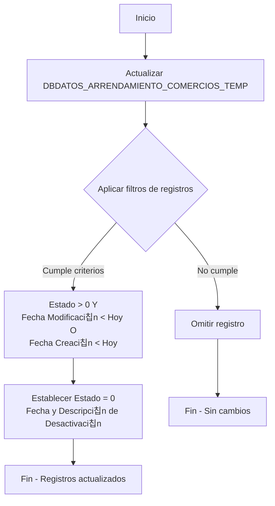

# Flujo de Procesos del Servicio de Sincronización

## Diagrama de Flujo General


## Resumen de Procedimientos Almacenados (SPs)

| Procedimiento Almacenado                                | Propósito Principal en el Flujo                                           |
| ------------------------------------------------------- | ------------------------------------------------------------------------- |
| `Sp_DbDatos_Arrendamiento_Pos_Business`                 | **(1)** Prepara los datos del ciclo de débitos.                            |
| `Comercios.Sp_Arrendamiento_Lista_gete`                 | **(2)** Obtiene la lista de comercios con arrendamiento activo.            |
| `Sp_DbDatos_Arrendamiento_Pos_Synchronize`              | **(3)** Inserta o actualiza cada comercio en una tabla temporal (BUCLE).           |
| `Sp_DbDatos_Arrendamiento_Pos_Disable`                  | **(4)** Desactiva comercios que no se actualizaron en el ciclo.            |
| `Sp_DbDatos_Arrendamiento_Pos_Alert_Get`                | **(6)** Obtiene los datos para el reporte de morosidad.                   |
| `Sp_DbDatos_Arrendamiento_Pos_Disconnect_Get`           | **(6)** Obtiene los datos para el reporte de inactivos.                   |
| `Sp_DbDatos_Arrendamiento_Pos_Alert_Destination_Get`    | **(7)** Obtiene los emails para enviar los reportes.                      |
| `sincronizacion_control` (Tabla)                        | **Control** Lee y escribe la fecha de la última ejecución de reportes.                 |

---

## 5.1. Sp_DbDatos_Arrendamiento_Pos_Business

Este procedimiento es el punto de partida para el ciclo de débito. Se encarga de seleccionar todos los comercios que son candidatos para el cobro de arrendamiento en una fecha determinada.

- **Propósito:** Obtener la lista de comercios a debitar.
- **Parámetros:**
    - `@Fecha (datetime)`: La fecha de ejecución del proceso. El SP buscará las transacciones generadas en esta fecha.
- **Lógica Principal:**
    1. Recibe una fecha como parámetro.
    2. Realiza una consulta compleja que une vistas (`Vw_Arrendamiento_Pos_comercios`) y tablas (`dftdet`, `dftnot`, `DbDatos_Bussiness_Data`, etc.).
    3. Filtra los comercios para incluir solo aquellos con:
        - Transacciones generadas en la fecha especificada.
        - Estado activo (`com.estado > 0`).
        - Saldo pendiente de pago (`com.saldo > 0`).
        - Débito no procesado (`d.estado = 0`).
    4. Devuelve un conjunto de resultados con toda la información necesaria para generar los débitos y las partidas contables correspondientes (datos del comercio, montos, información fiscal, cuentas contables, etc.).

### Diagrama de Flujo



---

## 5.2. Sp_DbDatos_Arrendamiento_Pos_Synchronize

Este SP se utiliza para mantener actualizada una tabla temporal con la información más reciente de los arrendamientos de los comercios. Actúa como un "upsert".

- **Propósito:** Insertar o actualizar la información de arrendamiento de un comercio.
- **Parámetros:**
    - `@RETAILER (varchar)`: Identificador del comercio.
    - `@RTLPADRE (varchar)`: Identificador del comercio padre (para consolidación).
    - `@CONSOLIDAR (int)`: Bandera que indica si el comercio consolida.
    - `@ARRENDAMIENTO (decimal)`: Monto del arrendamiento.
    - `@NOPOS (int)`: Número de POS asociados.
    - `@USER (varchar)`: Usuario que realiza la operación.
- **Lógica Principal:**
    1. Busca el `@RETAILER` en la tabla `DBDATOS_ARRENDAMIENTO_COMERCIOS_TEMP`.
    2. **Si no existe:** Realiza un `INSERT` para crear un nuevo registro.
    3. **Si existe:** Realiza un `UPDATE` para actualizar los datos del registro existente.

### Diagrama de Flujo



---

## 5.3. Sp_DbDatos_Arrendamiento_Pos_Alert_Get

Este procedimiento genera los datos necesarios para los reportes de morosidad, segmentando los resultados según el nivel de deuda.

- **Propósito:** Obtener datos para el reporte de morosidad.
- **Parámetros:**
    - `@Tipo (int)`: Define el tipo de reporte (1: deuda < 2 meses, 2: deuda > 1 mes).
    - `@Desde (datetime)`: Fecha de inicio del período a consultar.
    - `@Hasta (datetime)`: Fecha de fin del período a consultar.
- **Lógica Principal:**
    1. Utiliza el parámetro `@Tipo` para filtrar los comercios según la cantidad de meses que deben.
    2. Realiza una consulta compleja, similar a la del SP de *Business*, para recolectar datos del comercio, su deuda, abonos y débitos realizados en el rango de fechas.
    3. Devuelve un listado de comercios morosos con detalles sobre su deuda.

### Diagrama de Flujo



---

## 5.4. Sp_DbDatos_Arrendamiento_Pos_Disconnect_Get

Procedimiento simple para obtener un listado de todos los comercios que han sido marcados como inactivos.

- **Propósito:** Obtener datos para el reporte de comercios inactivos.
- **Parámetros:**
    - `@Estado (bit)`: Un parámetro que, aunque presente, no se utiliza en el `WHERE` principal, ya que la condición `pc.[estado] = 0` está fija.
- **Lógica Principal:**
    1. Consulta la vista `Vw_Arrendamiento_Pos_comercios`.
    2. Filtra los resultados para incluir únicamente los comercios cuyo estado es `0` (Inactivo).
    3. Devuelve un listado con la información principal de estos comercios.

### Diagrama de Flujo


---

## 5.5. Sp_DbDatos_Arrendamiento_Pos_Alert_Destination_Get

Este SP obtiene la lista de distribución de correos para el envío de alertas y reportes.

- **Propósito:** Obtener las direcciones de email para el envío de notificaciones.
- **Parámetros:**
    - `@IdSistema (bigint)`: ID del sistema que origina el reporte.
    - `@IdTipo (bigint)`: ID del tipo de reporte o mensaje.
- **Lógica Principal:**
    1. Consulta la tabla `DbDatos_Email_Destinations` y la une con `DbDatos_Empleados`.
    2. Filtra los resultados por `@IdSistema` y `@IdTipo`.
    3. Devuelve una lista de las direcciones de correo electrónico (`Email_Empresa`) de los empleados activos que deben recibir la notificación.

### Diagrama de Flujo



---

## 5.6. Comercios.Sp_Arrendamiento_Lista_gete

Este SP se invoca al inicio del ciclo de sincronización para obtener la lista de todos los comercios que tienen terminales con un monto de arrendamiento definido.

- **Propósito:** Obtener la lista inicial de comercios con arrendamiento activo para sincronizar.
- **Parámetros:**
    - `@Fecha (date)`: La fecha de corte para la consulta.
- **Lógica Principal:**
    1. Consulta la tabla `DbDatos_Terminals`.
    2. Filtra las terminales que tienen un `Monto_Arrendamiento` mayor a 0 y un estado activo (`Status = '0'`).
    3. Agrupa los resultados por comercio (`Retailer`) para obtener el monto total de arrendamiento y la cantidad de POS.
    4. Devuelve la lista de comercios que se deben sincronizar en la tabla temporal.

### Diagrama de Flujo



---

## 5.7. Sp_DbDatos_Arrendamiento_Pos_Disable

Este procedimiento se ejecuta para marcar como inactivos los registros de arrendamiento en la tabla temporal, principalmente para detener débitos automáticos.

- **Propósito:** Desactivar el cobro de arrendamiento para ciertos comercios.
- **Parámetros:** Ninguno.
- **Lógica Principal:**
    1. Actualiza la tabla `DBDATOS_ARRENDAMIENTO_COMERCIOS_TEMP`.
    2. Establece el `Estado` a `0` (inactivo) y registra una fecha y descripción de la desactivación.
    3. El criterio principal para la desactivación es que el registro no haya sido modificado durante el día actual.
    4. Incluye una lógica comentada que permitiría desactivar comercios si superan un umbral de 3 alertas.

### Diagrama de Flujo



---

## 5.8. Sp_DbDatos_Arrendamiento_Pos_Alert_Load

Procedimiento diseñado para llevar un conteo de las veces que un comercio aparece en un reporte de morosidad.

- **Propósito:** Incrementar el contador de alertas de morosidad.
- **Parámetros:** Ninguno.
- **Lógica Principal:**
    1. Consulta la tabla `DBDATOS_ARRENDAMIENTO_COMERCIOS_TEMP`.
    2. La une con la vista `Vw_Arrendamiento_Pos_comercios` para encontrar los comercios morosos.
    3. Para cada comercio que tiene más de un mes de deuda (`debe > 1`) y está activo, incrementa el campo `Alertas` en 1.

### Diagrama de Flujo


---

## ⚠️ **Notas Importantes sobre el Flujo Actual**

### **🔄 Sincronización Diaria vs Reportes Mensuales**
- **Los pasos 1-4 se ejecutan TODOS LOS DÍAS** sin excepción
- **Los pasos 6-7 solo se ejecutan UNA VEZ AL MES** cuando corresponde generar reportes
- La verificación de fechas determina si es momento de generar reportes

### **🔁 BUCLE Crítico en el Paso 3**
El `Sp_DbDatos_Arrendamiento_Pos_Synchronize` se ejecuta **una vez por cada comercio** obtenido en el paso 2. Esto puede ser cientos de ejecuciones en una sola pasada:

```csharp
foreach (var arrendamiento in arrendamientos)
{
    await _dataAccess.ExecuteSyncProcessAsync(arrendamiento);
}
```

### **📅 Control de Duplicados**
La tabla `sincronizacion_control` asegura que los reportes mensuales no se envíen más de una vez por mes, evitando spam a los destinatarios.

### **⚠️ SP Alert_Load - No se Ejecuta Actualmente**
Aunque el `Sp_DbDatos_Arrendamiento_Pos_Alert_Load` está documentado aquí y existe en la interfaz `IDataAccessService`, **actualmente no se ejecuta** en el flujo del `SyncService`. Está disponible para uso futuro si se necesita implementar conteo de alertas.